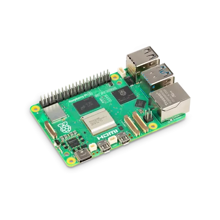
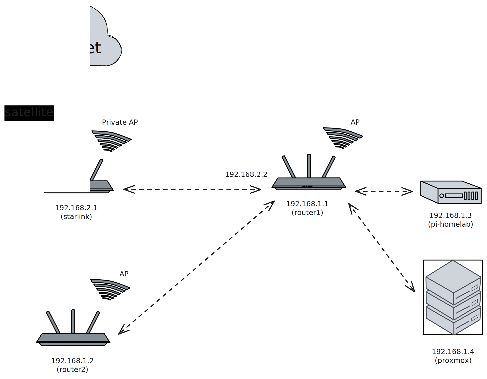

<div align="center">

[](LICENSE)
[](https://github.com/jorgeteixe/homelab/actions/workflows/acl-apply.yml)
[](https://github.com/jorgeteixe/homelab/actions/workflows/docker-apply.yml)



# Raspberry Pi 5 Powered Homelab

</div>

This repository contains the complete infrastructure-as-code configuration for my personal Raspberry Pi 5 homelab. The setup includes automated deployment, secret management, and a collection of self-hosted services for productivity, media management, and home automation.

> **Note**: This is a personal infrastructure repository. While suggestions via issues are welcome, pull requests are unlikely to be accepted as changes directly affect production services.

## Hardware network diagram



## 🏠 Services

The homelab runs the following self-hosted services:

| Service | Purpose | Access |
|---------|---------|--------|
| **[Homepage](https://github.com/gethomepage/homepage)** | Dashboard and service directory | `https://lab.teixe.es` |
| **[Caddy](https://caddyserver.com/)** | Reverse proxy with automatic HTTPS | Internal |
| **[CoreDNS](https://coredns.io/)** | DNS server for local resolution | `172.20.10.254` |
| **[Calibre Web Automated](https://github.com/crocodilestick/calibre-web-automated)** | Ebook library management | Via Homepage |
| **[Actual Budget](https://actualbudget.com/)** | Personal finance tracking | Via Homepage |
| **[KitchenOwl](https://github.com/TomBursch/kitchenowl)** | Grocery list and meal planning | Via Homepage |
| **[Mealie](https://mealie.io/)** | Recipe management | Via Homepage |
| **[AdventureLog](https://github.com/seanmorley15/AdventureLog)** | Travel and adventure tracking | Via Homepage |
| **[OpenBooks](https://github.com/evan-buss/openbooks)** | IRC book search and download | Via Homepage |

## 📁 Repository Structure

```
.
├── cloud-init/           # Raspberry Pi provisioning
│   ├── flash.sh         # SD card imaging script
│   ├── user-data        # Cloud-init configuration
│   └── network-config   # Network setup
├── docker/              # Container orchestration
│   ├── docker-compose.yml  # Main service definitions
│   └── config/         # Service-specific configurations
│       ├── caddy/      # Reverse proxy config
│       ├── coredns/    # DNS server config
│       ├── homepage/   # Dashboard configuration
│       └── adventurelog/ # Adventure tracking config
├── tailscale/          # VPN network configuration
│   └── policy.hujson   # Tailnet ACL policy
├── .github/workflows/  # CI/CD automation
└── Justfile           # Task automation recipes
```

## 🚀 Quick Start

### Prerequisites

- [Just](https://github.com/casey/just) - Command runner
- [SOPS](https://github.com/mozilla/sops) - Secret management
- [Docker](https://docs.docker.com/engine/install/) & [Docker Compose](https://docs.docker.com/compose/)
- [GPG](https://gnupg.org/) for SOPS encryption

### Initial Setup

1. **Flash Raspberry Pi SD Card**
   ```bash
   just flash /dev/sdX   # Replace with your SD card device
   ```

2. **Configure Secrets**
   ```bash
   # Decrypt existing secrets (requires proper SOPS keys)
   just decrypt
   
   # Or create new environment files:
   cp docker/.env.example docker/.env
   cp docker/config/adventurelog/.env.example docker/config/adventurelog/.env
   # Edit the .env files with your values, then encrypt:
   just encrypt
   ```

3. **Deploy Services**
   ```bash
   just docker-up       # Pulls images and starts all services
   ```

### Common Commands

| Command | Description |
|---------|-------------|
| `just` | Show all available commands |
| `just flash /dev/sdX` | Download Ubuntu, create bootable SD card with cloud-init |
| `just encrypt` | Encrypt all secrets using SOPS |
| `just decrypt` | Decrypt secrets for local development |
| `just fetch-updates` | Fetch git updates |
| `just docker-up` | Update from git, decrypt secrets, pull images, and start services |


## ⚙️ Architecture

### Networking

The homelab uses a **macvlan network** to give containers routable addresses through Tailscale and the local router:

- **Network**: `172.20.10.0/24`
- **Gateway**: `172.20.10.1`
- **DNS Server**: `172.20.10.254` (CoreDNS container)

### Security

- **Secret Management**: All sensitive data encrypted with [SOPS](https://github.com/mozilla/sops)
- **Network Isolation**: Services communicate through internal Docker networks
- **VPN Access**: Tailscale integration for secure remote access
- **HTTPS**: Automatic SSL certificates via Caddy with Cloudflare DNS challenge

### Automation

- **GitHub Actions**: Automatically applies Tailscale ACL changes and triggers deployments
- **Docker Health Checks**: Service monitoring and automatic restarts
- **Backup**: Configuration stored in Git, data volumes using separate backup strategy

## 🛠️ Development

### Local Testing

```bash
# Validate docker-compose configuration
docker compose config

# Check service health
docker compose ps

# View service logs
docker compose logs -f [service_name]
```

### Adding New Services

1. Add service definition to `docker/docker-compose.yml`
2. Create service configuration in `docker/config/[service]/`
3. Add service to Homepage dashboard configuration
4. Update Caddyfile for external access if needed
5. Test deployment with `just docker-up`

## 📝 Contributing

This repository serves as both documentation and actual infrastructure code. While the setup is personal:

- **Issues**: Bug reports and suggestions are welcome
- **Discussions**: Questions about the setup or architecture are encouraged  
- **Pull Requests**: Generally not accepted as changes affect production services

## 📄 License

This project is licensed under the [MIT License](LICENSE) - see the LICENSE file for details.

---

<div align="center">

**🏠 Powered by Raspberry Pi 5 • 🐳 Docker • ☁️ Self-hosted**

</div>
